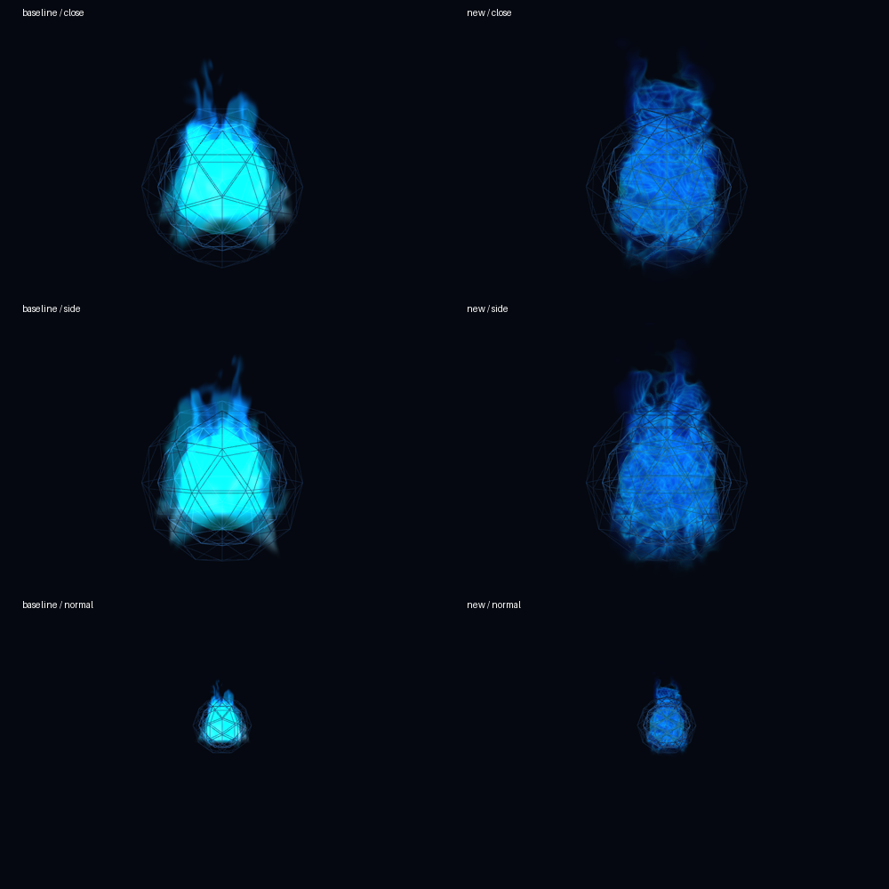

# Fase6 — candidato volumétrico, NO-GO de publicación

## Resultado

**No desplegado.** Mejora visual real inspeccionada, pero regresión de coste demasiado grande en el único renderer disponible. Producción mantiene el fuego anterior y su gate seguro. La fase6 **no está completada ni aprobada para producción**. No se implementó fase7.

Rama candidata `feat/jarvis-volumetric-fire`, apilada sobre `feat/jarvis-single-login` / PR4 abierta, base `710159086df80ed6f5956714dd2187264f7e1a95`.

## Candidato ejecutable

- `fire/shaders.js`: sustituye cuatro billboards aditivos por un volumen raymarch de caja, intersección near/far y origen de cámara transformado a espacio local. BackSide, depthTest, sin depthWrite; composición front-to-back y NormalBlending para no recortar el verde/cian por acumulación aditiva.
- Turbulencia 3D ascendente, hojas plegadas finas y erosión del contorno. Azul eléctrico con cian localizado; no esfera estática. Un atlas de ruido **generado localmente** de 256×256 RGBA, sin archivos nuevos de runtime, peticiones externas ni CDN. Liberación de geometría, material y textura.
- 40 pasos normales / 24 low, límite estático48 con early-out; salto de espacio vacío antes de ruido. Ajuste por presión de frames con histéresis; móvil inicia low. `reducedMotion` limita velocidad a0.2 y baja pasos; estados intensity/speed interpolados, contrato update/setState/dispose conservado. No RAF/timers propios.
- `index.html`: solo tres líneas de integración: versión del shader, calidad responsive, reducedMotion. Sin cambio de cámara, diseño, materiales del núcleo, sidebar, chat, login, executor, backend o puertos. `chat/core-state.js` intacto: conserva niveles RMS reales, estados y expiración existentes.
- No chispas adicionales: se priorizó volumen y se rechazó añadir más coste antes de resolver rendimiento.

## Evidencia visual: real, aislada, no autenticada

El componente carga Three.js r128 local de tests y el shader real candidato. Es una escena de pruebas aislada con el núcleo/wireframes existentes, **no una página de producción autenticada**, ni una captura de todo el dashboard. No se ocultó login, no se inyectó sesión ni se utilizaron credenciales.

`tests/core_visual_quality.py`: baseline leído con `git show` de la base conocida; normal100, cerca30, oblicuo0.78rad, lateral1.57, trasero3.14, low y reduced. Dos frames separados por actualizaciones por caso: **14 casos/28 PNG**. Programas enlazados en Chromium `/usr/bin/chromium` con ANGLE SwiftShader, glError0, píxeles azules visibles fuera del núcleo y frame-diffs positivos. Capturas revisadas con visión real: desaparece el parche cian uniforme, se ven pliegues internos y silueta turbulenta desde frente/lateral; los wireframes geométricos conservados siguen siendo visibles. No se confunden con billboards de fuego.

Fracción de píxeles azules activos con G/B>220: baseline cercano0.3848, candidato0.0. Esto es un guard cuantitativo contra clipping, no sustituye aceptación estética del propietario.

Todas las capturas y métricas: `/home/ddr/jarvis-phase6-artifacts/{baseline,new}/`, `quality-results.json`; selección versionada en `docs/evidence/phase6/`.

## Por qué NO se desplegó

Medianas de ocho renders **incluyendo readPixels sincronizado** a1200×800, mismo componente y entorno. Son tiempos software con coste de readback, **no FPS ni coste de GPU física**:

| Perfil | Baseline ms | Candidato ms |
|---|---:|---:|
| Normal |11.70|38.30|
| Cerca |24.55|279.05|
| Oblicuo |24.10|280.90|
| Lateral |24.70|271.10|
| Trasero |24.15|294.15|
| Low |25.00|183.30|
| Reduced |25.45|176.95|

El guard conservador de publicación rechaza >3× el baseline. El test final termina **exit1 / NO-GO: performance**, aunque sus contratos visuales son PASS. No se disimula como suite verde. Las primeras mediciones usando únicamente render+gl.finish devolvían ~0.2ms: eran encolado JS, **inválidas como render time**, y se corrigieron antes de decidir. Primer shader procedural llegó a ~689ms cercano; atlas local y salto del espacio vacío lo redujeron, pero no lo suficiente. Low tampoco resuelve el bloqueo. No se atribuye esta lentitud directamente a equipos físicos no probados.

Siguiente decisión requerida: optimización adicional con presupuesto de píxeles/pasos verificable, o medición legítima en hardware físico y aceptación del propietario antes de reconsiderar despliegue. No se cambia el diseño ni se fuerza una sesión para obtener esa prueba.

## Pruebas y revisión

- TDD observado: volumen falla4!=1 antes de implementar; transición suave falla2!=1; integración responsive ausente; atlas ausente; frames sostenidos0.3s no reducían calidad. Implementaciones posteriores y regresiones pasan. Logs RED seguros de atlas/slow en evidencia; no se versiona el volcado HTML del fallo de integración.
- `node --test tests/fire.test.cjs tests/fire_volume.cjs tests/core_activity.cjs tests/stt_core.cjs`: **12 PASS**. Contratos nuevos con objetos THREE reales: posición de cámara, una caja, textura local, disposal idempotente, estado interpolado, slow/recuperación, reduced, resume, integración sin nuevo RAF.
- `python3 tests/access_gate_test.py`: **15 PASS** incluyendo11 backend heredados. `python3 tests/access_browser_test.py BrowserAccess`: **1 PASS**, PHP real + MC fixture; no login propietario.
- `python3 tests/fire_webgl.py`: ejecutado PASS durante iteraciones; comparación final amplia sustituye la cobertura visual estrecha y conserva su fixture. Scripts originales no borrados.
- `node --check fire/shaders.js`, `python3 -m py_compile tests/core_visual_quality.py`, `git diff --check`: PASS. Shared-classic global declaration collision test PASS.
- Legacy `fire.test.cjs` se adapta solo para NormalBlending y transición suave. Tests chat/STT frontend dependientes del segundo login siguen sin migrarse en este alcance; no se presenta toda la suite legacy como aprobada.
- Una petición real a Qwen3-Coder-Next, respuesta guardada en `qwen-review.json`: APPROVE con advertencia de coste. Revisó versión procedural anterior, no atlas final. Sus propuestas de dynamic while/GL_GOOGLE_include_directive y afirmación24×48 no son correctas como solución universal WebGL1; no se aplicaron. El loop fijo con break es válido; Qwen no sustituye mediciones. Revisión propia final mantiene NO-GO por coste.
- Entorno de pruebas: faltaban Pillow y uv; se creó `/home/ddr/jarvis-phase6-venv` con `python3 -m venv` y se instalaron Playwright/Pillow allí, sin alterar Python del sistema.

## Producción y seguridad verificadas al cierre

No se escribió ningún archivo remoto ni se reinició servicio desde esta fase. Hashes remotos iniciales y finales coinciden para index/fire/core-state; exactos en `candidate-manifest.json`. **No es un manifiesto de despliegue**: identifica live frente a candidato y `deployed:false`. Al no haber publicación no se generó backup/rollback; cualquier futuro deploy sigue requiriendo preservación selectiva fuera del webroot, drift guards, reemplazos atómicos compatibles y verificación posterior. No nuevo asset runtime: gate/allowlist permanecen intactos. El cache-buster nuevo existe solo en Git candidato.

Comprobación pública final propia, sin seguir redirects: `/` e `/index.html`303, shader antiguo/nuevo y cuatro assets antiguos401, todos CF DYNAMIC + private,no-store. **El bloqueo Cloudflare anterior está resuelto**; no se cambiaron sus reglas desde esta tarea.

El parent confirmó y dejó evidencia en `/home/ddr/jarvis-port5000-containment/REPORT.md`: executor ahora127.0.0.1:5000, debug/reloaderFalse, health local200 y externo TCP111 refused. SHA posterior `c9af50dcf07a18ea61ef82fcf2c71e691e3df137ffd430c6573a1666ec25c269`. Esa intervención independiente no forma parte de este diff. Cierra exposición pública, **no prueba executor UI funcional** ni autenticación local; sigue sin ruta autorizada al frontend.

Pendiente: login/logout positivo real del propietario, evaluación estética y rendimiento en su equipo. No se revirtió seguridad y no se declara GO global.
