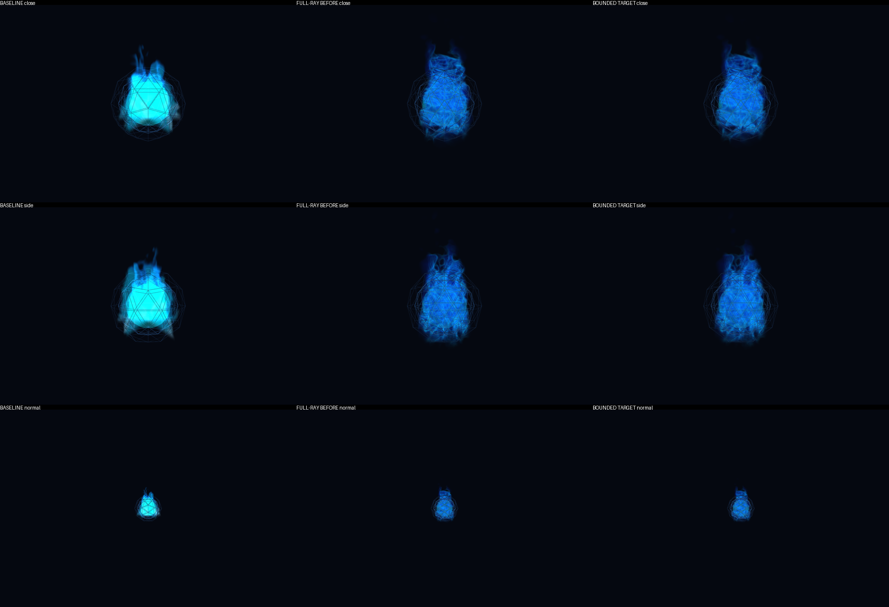

# Fase6 — fuego volumétrico con presupuesto de fragmentos

## Resultado técnico

**PASS del guard 3× sin cambiar el benchmark.** Una única optimización arquitectural conserva el raymarch 3D pero lo ejecuta en un render target limitado; composición de la caja a resolución nativa. La publicación selectiva se registra en `deployment-manifest.json` (no confundir con el antiguo `candidate-manifest.json`). No fase7, cambios de login/backend/Nginx/Cloudflare, permisos de micrófono ni autenticación inyectada.

Rama conservada `feat/jarvis-volumetric-fire`, PR5 apilada sobre `feat/jarvis-single-login`. El candidato anterior `c931da9acc14f0a950be5321bdc372032f1e8186` fue correctamente NO-GO y nunca se desplegó. Su informe y evidencia permanecen en Git; las mediciones/PNG originales también en `/home/ddr/jarvis-phase6-artifacts/pre-target/`.

## Perfil antes de implementar

`tests/fire_profile.py` reproduce el candidato anterior desde ese SHA y aísla costes en WebGL real. Cerca30, 1200×800, mediana8, readPixels dentro del intervalo:

| Caso diagnóstico | Submit JS ms | Render + readback ms |
|---|---:|---:|
| Raymarch anterior |0.30|279.90|
| Sin fuego |0.20|12.00|
| Misma caja, fragmento plano |0.20|14.60|

Esto localiza la regresión en shading/fragmentos, no en geometría ni actualizaciones JS. El submit solo mide encolado CPU; la columna sincronizada incluye render software y readback, **no tiempo de GPU física ni FPS**. El shader plano es exclusivamente diagnóstico y nunca el resultado publicado. Fuente de datos: `profile-before.json`.

## Cambio acotado

- El mismo volumen 3D, cámara local, turbulencia ascendente, atlas local, 40/24 pasos, alpha y transiciones de audio reales. No cuatro planos ni esfera estática.
- `WebGLRenderTarget` RGBA, filtro lineal, sin depth/stencil/mipmaps; un tercio de la dimensión de viewport físico, máximo512 en el lado largo. A1200×800:400×267. Solo el fuego reduce resolución; núcleo, wireframes, escena y UI siguen a resolución original.
- Raymarch con NoBlending al target transparente para conservar RGBA straight; composición NormalBlending sobre la caja BackSide existente, depthTest activo y depthWrite desactivado. Conserva el contrato de profundidad de la caja anterior; no se afirma intersección volumétrica exacta con objetos dentro del volumen.
- Offscreen render dentro de `onBeforeRender`, sin RAF/timers adicionales. Preserva/restaura target, viewport, scissor, clear color/alpha, autoClear, XR e info.autoReset mediante finally. Los contadores incluyen ambas pasadas (5 draws en el fixture, no el engañoso2 de un reset anidado).
- Tamaño adaptado al viewport/DPR y liberación idempotente de target, atlas, materiales y geometría. Contratos update/setState/dispose y reducedMotion conservados.
- `index.html`: tres líneas frente al baseline fase5: versión de asset, calidad responsive y reducedMotion. No cambios a `chat/core-state.js`.

## Comparativa final sin tocar el guard ni esconder readback

`tests/core_visual_quality.py` permanece idéntico al candidato anterior. Mismo Chromium `/usr/bin/chromium`, ANGLE SwiftShader, viewport1200×800, baseline Git `710159086df80ed6f5956714dd2187264f7e1a95`; ocho renders con readPixels por caso. Son tiempos de renderer software, no rendimiento del dispositivo del propietario.

| Perfil | Baseline ms | Target ms |
|---|---:|---:|
| Normal100 |11.70|14.10|
| Cerca30 |24.75|46.55|
| Oblicuo |24.80|47.60|
| Lateral |24.20|48.45|
| Trasero |24.65|53.20|
| Low |25.10|34.80|
| Reduced |24.50|34.50|

**PASS**: ningún perfil supera3×. Frente al raymarch anterior: normal38.30→14.10, cerca279.05→46.55, low183.30→34.80. Son ejecuciones distintas, no una garantía estadística para hardware físico. El coste sigue siendo mayor que baseline, se informa explícitamente.

## Visión y pruebas

Inspección visual real del PNG: conserva pliegues internos azules y contorno turbulento, evita el centro cian plano del baseline y sigue visible desde el lateral. El target suaviza detalles muy finos respecto al raymarch completo; no se ven parches rectangulares ni planos cruzados. Es un compromiso de resolución explícito, no calidad idéntica. Comparación de componente aislado: **no captura autenticada del dashboard ni aceptación estética final del propietario**.

- Quality:14 casos/28 PNG reales, cuatro programas GL enlazados, glError0, animación con diferencias de frames, azul visible fuera del núcleo y fracción cian clipped0.0 para todos los candidatos.
- TDD real: `fire_target.py` falla primero por ausencia de target; tras implementar pasa. Segundo RED por reset de contadores anidado; preservación de info.autoReset lo corrige.
- `fire_target.py` PASS: presupuesto400×267, restauración de renderer, alpha transparente/visible, oclusor opaco delantero, resize DPR2, liberación de las dos texturas GPU y disposal idempotente.
- `node --test tests/fire.test.cjs tests/fire_volume.cjs tests/core_activity.cjs tests/stt_core.cjs`:12 PASS; estados RMS, transiciones, reduced, recuperación, único RAF y ausencia de colisión entre scripts classic.
- `tests/fire_webgl.py`:PASS en Chromium/SwiftShader real,3 vistas con movimiento.
- `python3 tests/access_gate_test.py`:15 PASS (incluye backend heredado).
- `tests/access_browser_test.py BrowserAccess`:1 PASS, PHP real y fixture MC autorizado; no login del propietario.
- `node --check fire/shaders.js`, compilación Python y `git diff --check`:PASS.
- No se presenta toda la suite legacy chat/STT del segundo login como verde; su migración sigue fuera del alcance, fase7 pendiente.

## Seguridad / entrega

Solo se autorizan `fire/shaders.js` e `index.html`, con hash guard fase5, preservación selectiva fuera del webroot y reemplazo atómico por archivo (shader primero compatible con índice anterior). No restart/reload ni nuevo asset en allowlist. Las rutas protegidas no permiten comparar bytes públicos de assets sin sesión: hashes de origen por SSH y comprobaciones públicas anónimas303/401 son pruebas distintas, no se finge descarga pública autenticada.

Evidencia completa en `/home/ddr/jarvis-phase6-artifacts/`: `quality-results.json`, `profile-before.json`, `target-comparison.png`, `baseline/`, `new/`, manifiesto y resultados públicos. Selección versionada en `docs/evidence/phase6/`.

Pendientes: login/logout positivo real del propietario, aceptación estética y coste/interacción en su GPU física. El guard software superado autoriza esta entrega acotada, **no GO global de todas las fases**. Executor, acceso y fase7 no se modificaron.
